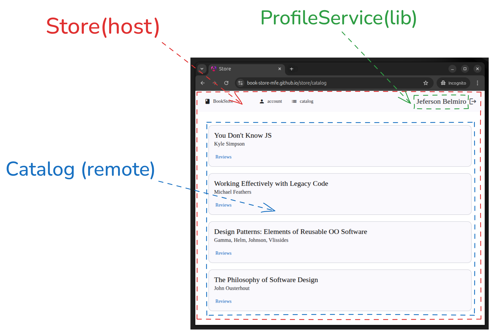
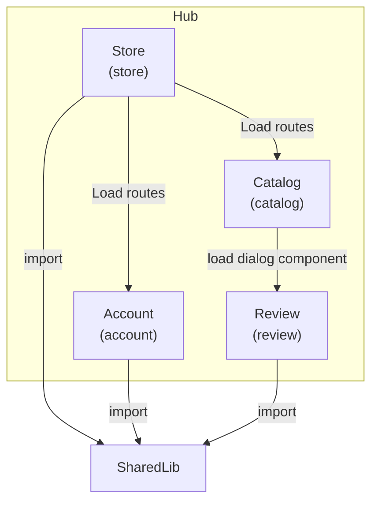
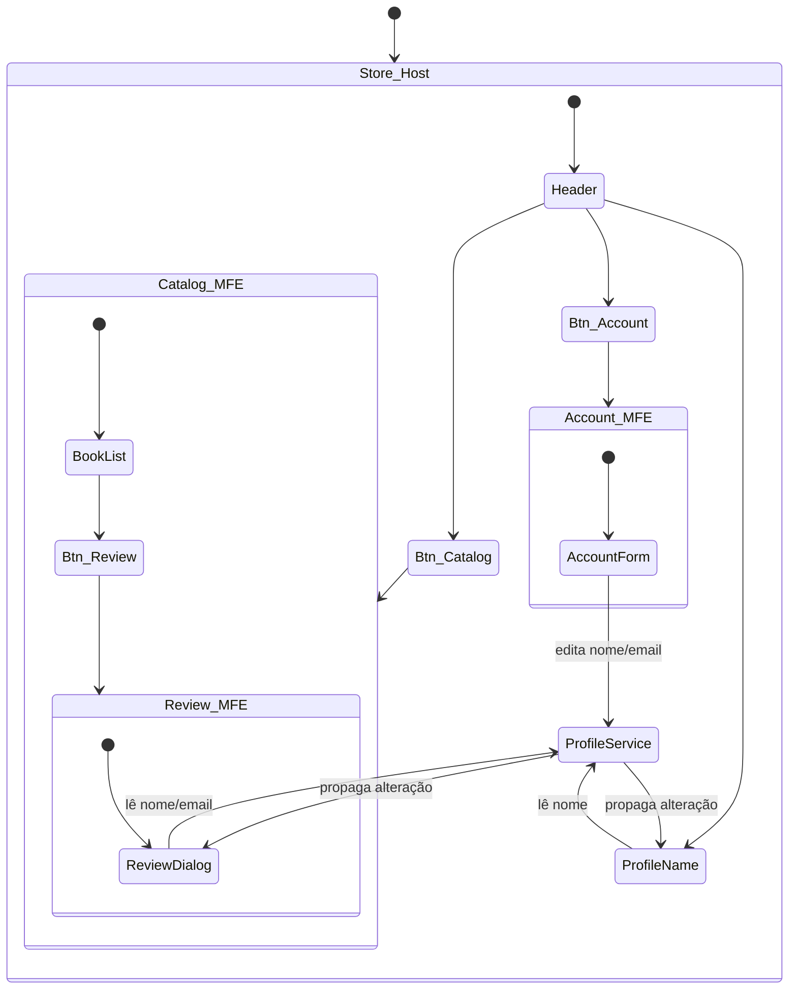
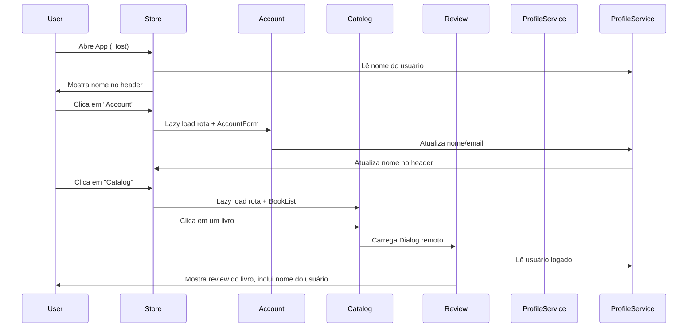

# Book Store MFE - Hub

Este repositório centraliza os microfrontends da Book Store via submodules Git.

## 📦 Módulos

* [store](https://github.com/book-store-mfe/store): Host (Shell da aplicação)
* [catalog](https://github.com/book-store-mfe/catalog): Catálogo de livros
* [account](https://github.com/book-store-mfe/account): Área do usuário (login/profile)
* [review](https://github.com/book-store-mfe/review): Reviews de livros
* shared-lib: Biblioteca para estado do usuário

---

## preview



## 🗺️ Arquitetura Geral



---

## 🚀 Deploy dos Microfrontends via GitHub Actions

Cada microfrontend está configurado para fazer deploy de forma **independente** utilizando GitHub Actions e o GitHub Pages.

* **Cada projeto (store, account, catalog, review)** possui um workflow no `.github/workflows/` que escuta alterações na branch `main` e publica automaticamente o build da aplicação no GitHub Pages.
* O deploy é feito no branch `gh-pages` de cada repositório.

---

### Fluxo de deploy

```mermaid
flowchart TD
    subgraph Store [store repo]
      StoreMain[(main branch)]
      StoreAction[[GitHub Action]]
      StoreGhPages[(gh-pages branch)]
      StorePage[/github.io/store/]
    end
    subgraph Account [account repo]
      AccountMain[(main branch)]
      AccountAction[[GitHub Action]]
      AccountGhPages[(gh-pages branch)]
      AccountPage[/github.io/account/]
    end
    subgraph Catalog [catalog repo]
      CatalogMain[(main branch)]
      CatalogAction[[GitHub Action]]
      CatalogGhPages[(gh-pages branch)]
      CatalogPage[/github.io/catalog/]
    end
    subgraph Review [review repo]
      ReviewMain[(main branch)]
      ReviewAction[[GitHub Action]]
      ReviewGhPages[(gh-pages branch)]
      ReviewPage[/github.io/review/]
    end

    StoreMain --> StoreAction --> StoreGhPages --> StorePage
    AccountMain --> AccountAction --> AccountGhPages --> AccountPage
    CatalogMain --> CatalogAction --> CatalogGhPages --> CatalogPage
    ReviewMain --> ReviewAction --> ReviewGhPages --> ReviewPage
```



---

## 🧩 Componentes e Fluxo

### 📁 Hub

* Repositório facilitador, **não expõe app**.
* Tem cada app como submodule (facilita setup e dev local).

---

### 🏠 **Store (Host)**

* App shell (host do Module Federation).
* Header com botões de navegação.
* Importa `ProfileService` de uma lib npm compartilhada (`shared-lib`).

#### Header:

* **Botão Account:** Navega para rota da MFE Account (lazy load remoto), carrega `AccountForm`.
* **Botão Catalog:** Navega para rota da MFE Catalog (lazy load remoto), carrega `BookList`.
* **Nome do usuário:** Mostra estado do usuário usando o `ProfileService` compartilhado.

---

### 👤 **Account**

* Carregada via rota pelo Store.
* Exibe e edita o nome/email (usa `ProfileService`).
* Ao editar, sincroniza o estado com todas MFEs (host + remotes).

---

### 📚 **Catalog**

* Carregada via rota pelo Store.
* Componente `BookList`: lista de livros.
* Clicar em um livro exibe **dialog para reviews**.

---

### ⭐ **Review**

* Carregada sob demanda pelo Catalog, via Module Federation.
* Exporta uma Dialog para exibir o review do livro.
* Usa o estado do usuário compartilhado via `ProfileService`.

---

### 🧬 **State Diagram**



### 🔄 **Sequence Diagram**



---

## 🚀 Como clonar o repositório com todos os submodules

```sh
git clone --recurse-submodules https://github.com/book-store-mfe/hub.git
```

Ou, se já clonou sem submodules:

```sh
git submodule update --init --recursive
```

---

## 🔄 Atualizando todos os submodules

```sh
git submodule update --remote --merge
```

---

## Iniciando um módulo específico

Por exemplo, para rodar o **store**:

```sh
cd store
npm start
```

Para o **catalog**:

```sh
cd catalog
npm start
```

---

## Iniciando TODOS os módulos juntos

```sh
npm run start:all
```

Isso inicia todos os apps em paralelo.

---
