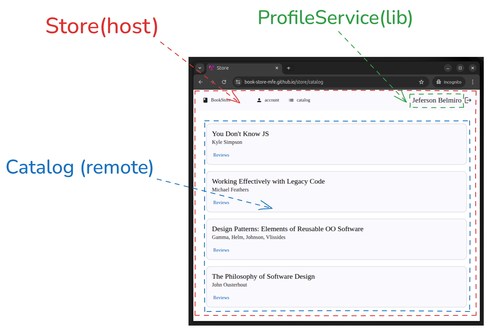
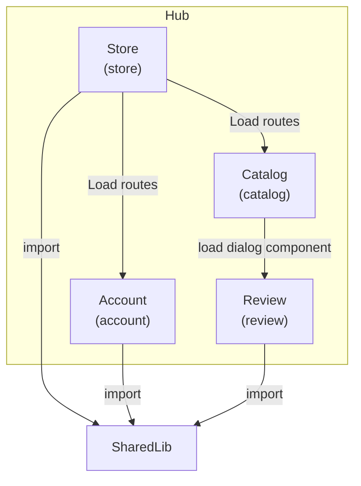
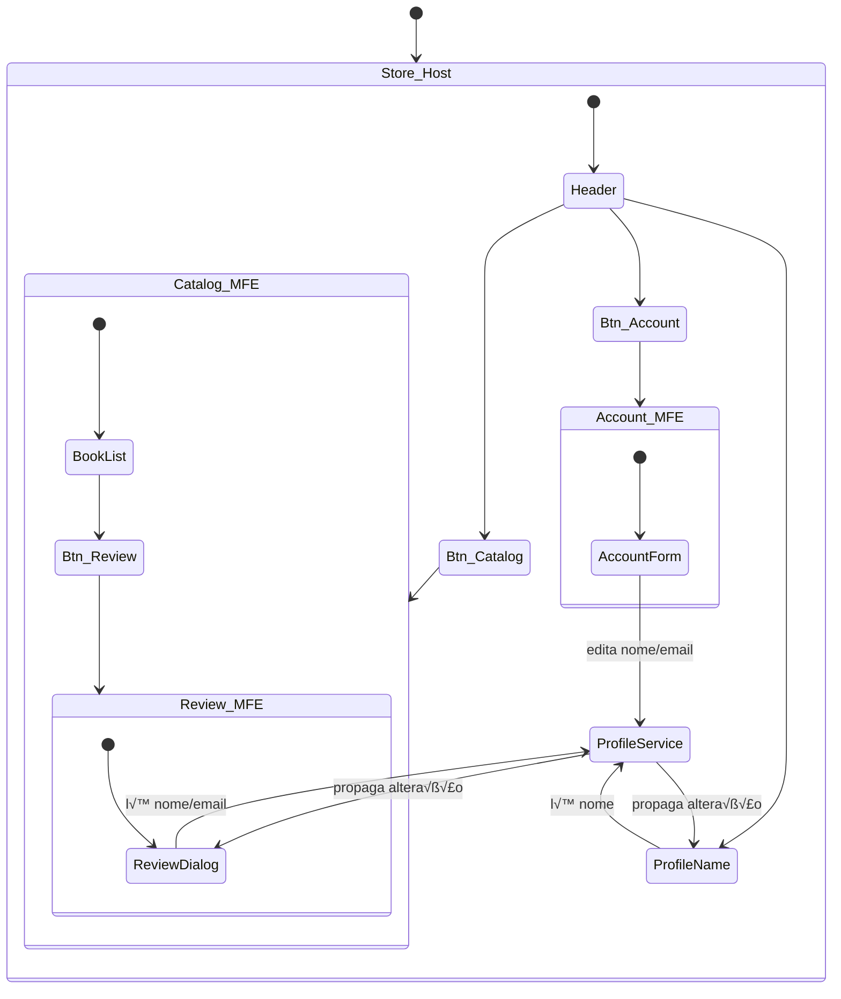
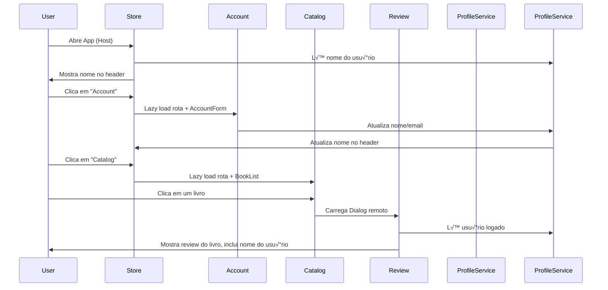

# Book Store MFE - Hub

Este repositório centraliza os microfrontends da Book Store via submodules Git.

## 📦 Módulos

* [store](https://github.com/book-store-mfe/store): Host (Shell da aplicação)
* [catalog](https://github.com/book-store-mfe/catalog): Cat√°logo de livros
* [account](https://github.com/book-store-mfe/account): Área do usuário (login/profile)
* [review](https://github.com/book-store-mfe/review): Reviews de livros
* [shared-lib](https://github.com/book-store-mfe/shared-lib): Biblioteca compartilhada

---

## preview



## 🗺️ Arquitetura Geral


```mermaid
flowchart TD
    subgraph Hub ["Hub"]
        StoreMFE["Store<br/>(store)"]
        CatalogMFE["Catalog<br/>(catalog)"]
        AccountMFE["Account<br/>(account)"]
        ReviewMFE["Review<br/>(review)"]
    end

    SharedLib["SharedLib"]


    StoreMFE -- "Load routes" --> CatalogMFE
    StoreMFE -- "Load routes" --> AccountMFE

    StoreMFE -- "import" --> SharedLib
    AccountMFE -- "import" --> SharedLib
    ReviewMFE -- "import" --> SharedLib
    CatalogMFE -- "load dialog component" --> ReviewMFE
```

---

## üöÄ Deploy dos Microfrontends via GitHub Actions

Cada microfrontend est√° configurado para fazer deploy de forma **independente** utilizando GitHub Actions e o GitHub Pages.

* **Cada projeto (store, account, catalog, review)** possui um workflow no `.github/workflows/` que escuta alterações na branch `main` e publica automaticamente o build da aplicação no GitHub Pages.
* O deploy é feito no branch `gh-pages` de cada repositório.

---

### Fluxo de deploy


```mermaid
flowchart TD
    subgraph SharedLib [shared-lib repo]
      SharedLibMain[(main branch)]
      SharedLibAction[[GitHub Action]]
      NpmRegistry[(npm registry)]
    end
    subgraph Review [review repo]
      ReviewMain[(main branch)]
      ReviewAction[[GitHub Action]]
      ReviewGhPages[(gh-pages branch)]
      ReviewPage[/github.io/review/]
    end
    subgraph Account [account repo]
      AccountMain[(main branch)]
      AccountAction[[GitHub Action]]
      AccountGhPages[(gh-pages branch)]
      AccountPage[/github.io/account/]
    end
    subgraph Catalog [catalog repo]
      CatalogMain[(main branch)]
      CatalogAction[[GitHub Action]]
      CatalogGhPages[(gh-pages branch)]
      CatalogPage[/github.io/catalog/]
    end
    subgraph Store [store repo]
      StoreMain[(main branch)]
      StoreAction[[GitHub Action]]
      StoreGhPages[(gh-pages branch)]
      StorePage[/github.io/store/]
    end

    SharedLibMain --> SharedLibAction --> NpmRegistry
    StoreMain --> StoreAction --> StoreGhPages --> StorePage
    AccountMain --> AccountAction --> AccountGhPages --> AccountPage
    CatalogMain --> CatalogAction --> CatalogGhPages --> CatalogPage
    ReviewMain --> ReviewAction --> ReviewGhPages --> ReviewPage
```

---


## üß© Componentes e Fluxo

### 📁 Hub

* Repositório facilitador, **não expõe app**.
* Tem cada app como submodule (facilita setup e dev local).

---

### 🏠 **Store (Host)**

* App shell (host do Module Federation).
* Header com botões de navegação.
* Importa `ProfileService` de uma lib npm compartilhada (`shared-lib`).

#### Header:

* **Bot√£o Account:** Navega para rota da MFE Account (lazy load remoto), carrega `AccountForm`.
* **Bot√£o Catalog:** Navega para rota da MFE Catalog (lazy load remoto), carrega `BookList`.
* **Nome do usu√°rio:** Mostra estado do usu√°rio usando o `ProfileService` compartilhado.

---

### 👤 **Account**

* Carregada via rota pelo Store.
* Exibe e edita o nome/email (usa `ProfileService`).
* Ao editar, sincroniza o estado com todas MFEs (host + remotes).

---

### üìö **Catalog**

* Carregada via rota pelo Store.
* Componente `BookList`: lista de livros.
* Clicar em um livro exibe **dialog para reviews**.

---

### ⭐ **Review**

* Carregada sob demanda pelo Catalog, via Module Federation.
* Exporta uma Dialog para exibir o review do livro.
* Usa o estado do usu√°rio compartilhado via `ProfileService`.

---

### 🧬 **State Diagram**


```mermaid
stateDiagram-v2
    [*] --> Store_Host

    state Review_MFE {
      [*] --> ReviewDialog
      ReviewDialog --> ProfileService : lê nome/email
    }

    state Account_MFE {
      [*] --> AccountForm
      AccountForm --> ProfileService : edita nome/email
    }

    state Catalog_MFE {
      [*] --> BookList
      %%BookList --> Review_MFE : ao clicar em review
      BookList --> Btn_Review
      Btn_Review --> Review_MFE
    }

    state Store_Host {
      [*] --> Header
      Header --> ProfileName
      Header --> Btn_Account
      Header --> Btn_Catalog
      ProfileName --> ProfileService : lê nome

      Btn_Account --> Account_MFE
      Btn_Catalog --> Catalog_MFE
    }


    ProfileService --> ProfileName : propaga alteração
    ProfileService --> ReviewDialog : propaga alteração
```

### 🔄 **Sequence Diagram**


```mermaid
sequenceDiagram
    participant User
    participant Store
    participant Account
    participant Catalog
    participant Review
    participant SharedLib as ProfileService

    User->>Store: Abre App (Host)
    Store->>ProfileService: Lê nome do usuário
    Store->>User: Mostra nome no header

    User->>Store: Clica em "Account"
    Store->>Account: Lazy load rota + AccountForm
    Account->>ProfileService: Atualiza nome/email
    ProfileService->>Store: Atualiza nome no header

    User->>Store: Clica em "Catalog"
    Store->>Catalog: Lazy load rota + BookList

    User->>Catalog: Clica em um livro
    Catalog->>Review: Carrega Dialog remoto
    Review->>ProfileService: Lê usuário logado
    Review->>User: Mostra review do livro, inclui nome do usu√°rio
```

---

## 🚀 Como clonar o repositório com todos os submodules

```sh
git clone --recurse-submodules https://github.com/book-store-mfe/hub.git
```

Ou, se j√° clonou sem submodules:

```sh
git submodule update --init --recursive
```

---

## 🔄 Atualizando todos os submodules

```sh
git submodule update --remote --merge
```

---

## Iniciando um módulo específico

Por exemplo, para rodar o **catalog**:

```sh
npm install:catalog
npm start:catalog
```

---

## Iniciando TODOS os módulos juntos

```sh
npm run install:all
npm run start:all
```

Isso inicia todos os apps em paralelo.

---

## üîó Usando `shared-lib` localmente com `npm link`

Durante o desenvolvimento, é possível consumir o pacote `shared-lib` **localmente**, sem precisar publicar no NPM, usando o comando `npm link`.

### Passo a passo para integração local

#### 1. Build do shared-lib

Entre na pasta do submodule `shared-lib`:

```sh
cd shared-lib
npm install
npm run build
```

#### 2. Link global do shared-lib

```sh
cd dist/shared-lib
npm link
```

Isso vai registrar o pacote localmente na sua m√°quina.

#### 3. Link nos MFEs (store, catalog, account, review)

Para cada microfrontend que consome o shared-lib, rode:

```sh
cd ../store      # (ou catalog, account, review)
npm link @bookstore-app/shared-lib
```

Repita para todos os MFEs que v√£o consumir a shared-lib.

#### 4. Rodando em dev

* Ao rodar `npm start` em cada MFE, o código da `shared-lib` será importado diretamente do seu diretório local.
* Sempre que fizer alterações no código da lib, execute `npm run build` novamente dentro de `shared-lib` para propagar as mudanças.
* Os MFEs verão a versão mais recente do código buildado automaticamente (pode ser necessário reiniciar a aplicação em alguns casos).

#### 5. Removendo o link (opcional)

Se quiser voltar a usar a vers√£o publicada no NPM:

```sh
cd store
npm unlink @bookstore-app/shared-lib
```

Repita para cada microfrontend que usava o link.

---

### üìë Dicas

* O `npm link` cria symlinks. Pode ter conflitos se dependências peer (ex: React, Angular) não forem iguais. Se tiver erros estranhos, limpe o `node_modules` e reinstale tudo.
* Lembre-se de sempre rodar o build da lib após alterar o código-fonte.
* Esse fluxo é excelente para acelerar o desenvolvimento multi-repo sem precisar publicar releases no npm a cada alteração.
